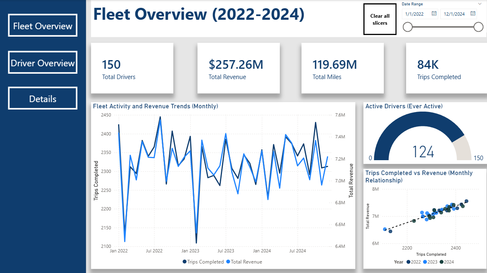
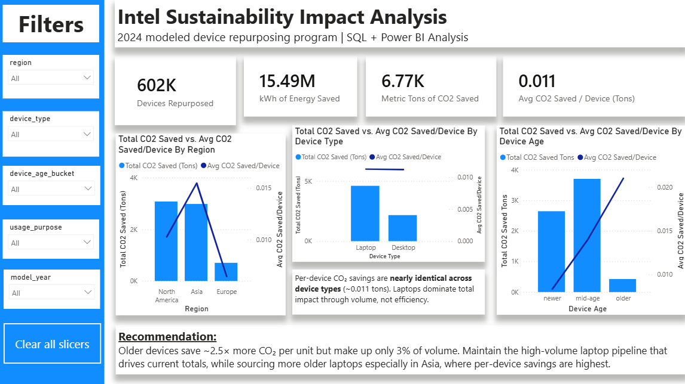
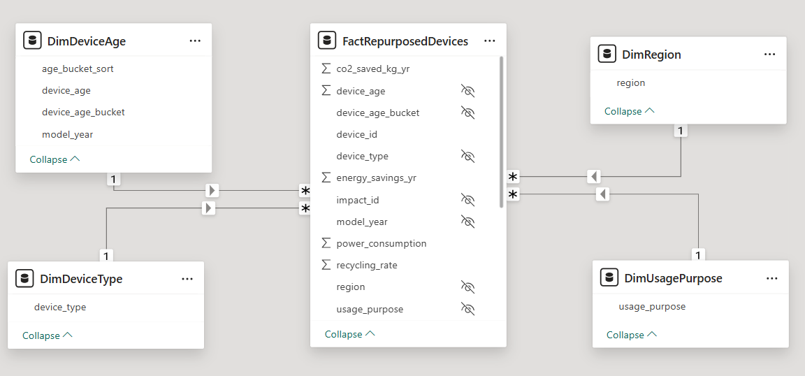

# Anthony Desimone  
**Data Analyst | SQL · Power BI · Excel · Python · R**
 
I am a senior at the University of South Florida with a quantitative background in chemistry and economics, focused on applying data analysis to operational and business decision-making.
 
- LinkedIn: [https://www.linkedin.com/in/anthonyfdesimone/](https://www.linkedin.com/in/anthonyfdesimone/)
- GitHub: [https://github.com/afdesimone](https://github.com/afdesimone)
This portfolio highlights analytics projects centered on evaluating business assumptions, interpreting results, and supporting data-driven decisions.
 
---
 
## Featured Projects
 
### Logistics Operations Analytics — Driver Performance & Fleet Efficiency
 

 
> **Key Insight**  
> Analysis showed minimal variation in driver-level KPIs and limited impact on revenue, indicating that individual driver performance is not a primary operational driving force. Results suggest that system-level factors such as routing, demand patterns, and load characteristics are more likely to drive revenue and efficiency.
 
**Business Problem**  
Operations teams often assume that individual driver performance materially affects revenue and efficiency. This project evaluates whether driver-level KPIs meaningfully explain revenue outcomes or whether performance is driven by system-level factors.
 
**Supporting Evidence**  
- Driver-level performance metrics showed minimal variation across individuals  
- Individual driver KPIs exhibited limited explanatory power with respect to revenue  
- Performance patterns were consistent across time periods and drivers  
**Business Implications**  
- Individual driver performance is unlikely to be a high-impact management lever  
- Analytical and operational focus should be directed toward system-level drivers rather than driver-level interventions  
**Analytical Approach & Deliverables**  
- Designed a relational data model and created SQL views consumed by Power BI to ensure consistent KPI reporting, with CTEs used for exploratory and ad-hoc analysis  
- Analyzed driver and fleet-level performance trends using SQL  
- Developed interactive Power BI dashboards to support fleet-level monitoring and decision-making  
View GitHub Repository: [https://github.com/afdesimone/logistics-operations-analytics](https://github.com/afdesimone/logistics-operations-analytics)
 
---
 
### Intel Sustainability Analytics — Device Repurposing Program Impact
 

 
> **Key Insight**  
> Total program impact is currently driven by laptop volume, but older devices produce roughly 2.5x the per-device energy savings of newer ones. Maintaining the high-volume laptop pipeline while gradually shifting sourcing toward older laptops in carbon-intensive regions is the higher-impact path forward.
 
**Business Problem**  
Intel's 2024 device repurposing program saved a meaningful amount of energy and CO₂, but program leadership needed to understand which device segments drove the most impact and where future sourcing should be prioritized to maximize per-device benefit.
 
**Supporting Evidence**  
- 601,740 repurposed devices analyzed across two joined datasets  
- Total program impact: 15.5 million kWh of energy saved and 6,768 metric tons of CO₂ saved annually  
- Older devices averaged 48 kWh saved per device vs. 19 kWh for newer devices (~2.5x per-device benefit)  
- Laptops accounted for ~68% of total energy and CO₂ savings, primarily because they made up the majority of repurposed devices  
- North America produced the highest total CO₂ savings due to volume; Asia produced the highest per-device savings due to a more carbon-intensive grid  
**Business Implications**  
- Total impact and per-device impact are different optimization targets, and program decisions should distinguish between them  
- Future sourcing efforts should prioritize older laptops in carbon-intensive regions to lift per-device program impact without sacrificing scale  
- Continuing to rely on volume alone leaves per-device benefit on the table  
**Analytical Approach & Deliverables**  
- Built a PostgreSQL schema and ran a structured validation pass (row counts, duplicate checks, missing values, join integrity, range checks) before analysis  
- Joined the device and impact datasets and created a reusable analysis view with derived device age and age-bucket fields using `CASE WHEN` logic  
- Aggregated impact by device type, age bucket, region, and combined segments using grouped aggregations and CTEs for percentage calculations  
- Modeled the SQL analysis view as a Power BI star schema (fact + four dimension tables) with DAX measures for total devices, energy savings, CO₂ savings, and per-device averages  
- Designed an executive dashboard with KPI cards, slicers, and combo charts comparing total versus per-device impact for stakeholder communication  
**Power BI Data Model**  
 

 
The SQL analysis view was loaded into Power BI and reorganized into a star schema with dimension tables for region, device type, usage purpose, and device age, supporting clean filtering, slicer-driven exploration, and reusable DAX measures.
 
View GitHub Repository: [https://github.com/afdesimone/intel-sustainability-analytics](https://github.com/afdesimone/intel-sustainability-analytics)
 
---
 
## Technical Skills
- SQL (PostgreSQL, SQLite, joins, aggregations, CTEs, views, schema design, `CASE WHEN` logic)
- Power BI (data modeling, star schema design, DAX measures, interactive dashboards)
- Microsoft Excel (pivot tables, formulas, Power Query, LINEST regression)
- Python (pandas, numpy, matplotlib, plotly express)
- R (regression analysis, data visualization)
